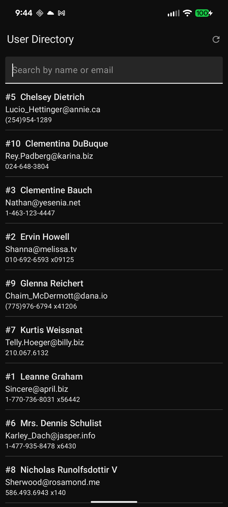
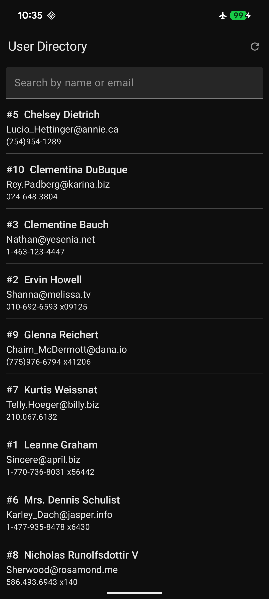
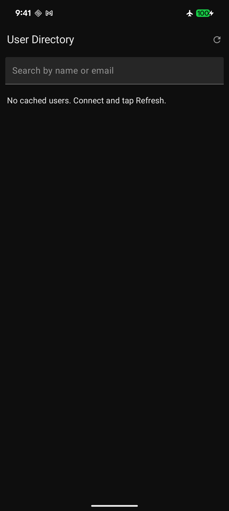
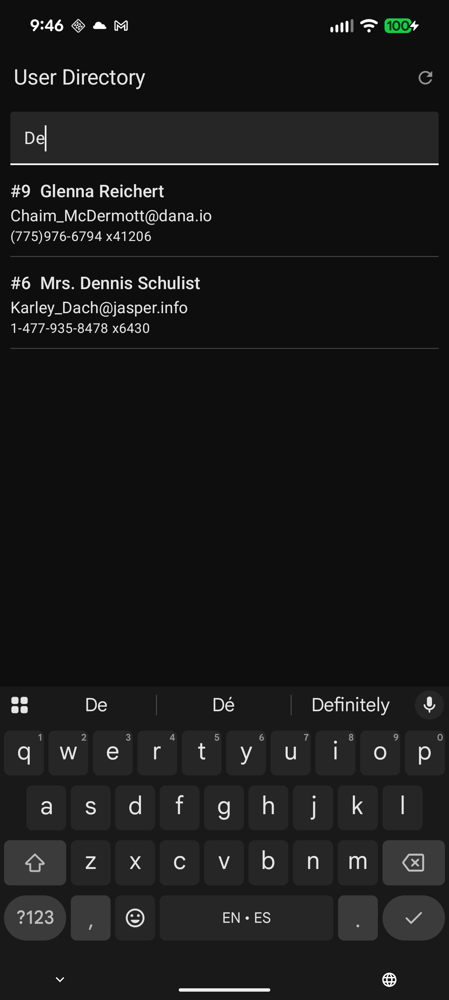

# User Directory

An offline-first Android app that displays a list of users from the **JSONPlaceholder API**  
(`https://jsonplaceholder.typicode.com/users`).

---

## Overview
The app retrieves user data (id, name, email, phone) using **Retrofit** and stores it locally using **Room Database**.  
It follows an **offline-first** architecture so the UI always reads from Room and automatically updates when new data is fetched.

---

## Key Features
- **Offline-first architecture** with Room + Flow
- **Retrofit (GET only)** for user data retrieval
- **Local search** by name or email (no API call)
- **Jetpack Compose UI** with reactive updates
- **Coroutines** for background refresh
- **Manual refresh button** in top bar

---

## How It Works (Core Logic)
The app reads user data from **Room** immediately at launch.  
If network is available, it fetches fresh data via **Retrofit (GET)** and saves it using `OnConflictStrategy.REPLACE`,  
updating the Room database so the UI refreshes automatically.

---

## Screenshots

| Online (first fetch) | Offline (cached) | First-Run Offline | Local Search |
|----------------------|------------------|-------------------|--------------|
|  |  |  |  |


---

## Tech Stack
- **Language:** Kotlin
- **UI:** Jetpack Compose (Material 3)
- **Architecture:** MVVM (ViewModel + Repository + Room + Flow)
- **Networking:** Retrofit + Gson
- **Database:** Room
- **Concurrency:** Coroutines

---

## How to Run
1. Clone the repository:
   ```bash
   git clone https://github.com/jmgonzalez06/User-Directory
   ```
2. Open in Android Studio (latest version).
3. Ensure INTERNET permission exists in AndroidManifest.xml.
4. Run the app on an emulator or physical device.

---

## Testing Guide

| Scenario           | Expected Result                              |
|--------------------|----------------------------------------------|
| Online launch      | 10 users appear from API                     |
| Offline relaunch   | Cached data displays instantly               |
| First-run offline  | Shows empty-state message                    |
| Search             | Filters Room data locally                    |
| Tap refresh        | Refetches from API without duplication       |

---

## Author
**Jose Manuel Gonzalez Alfaro**

CPSC 411A-02 — California State University, Fullerton

---

### License
For educational use under the coursework of California State University, Fullerton.